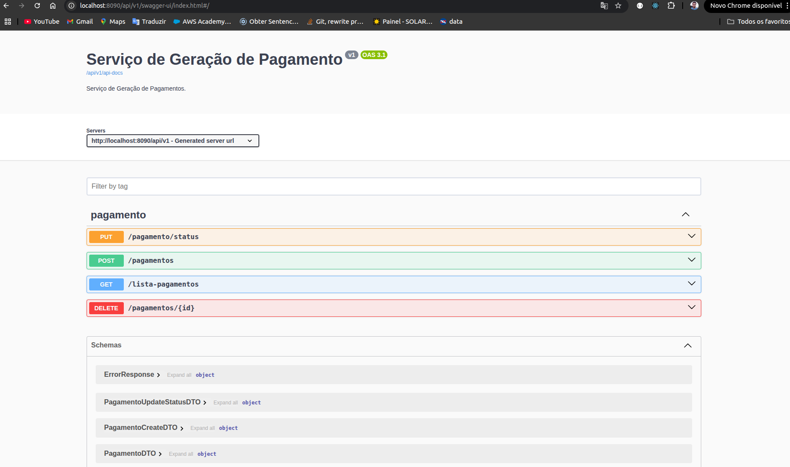
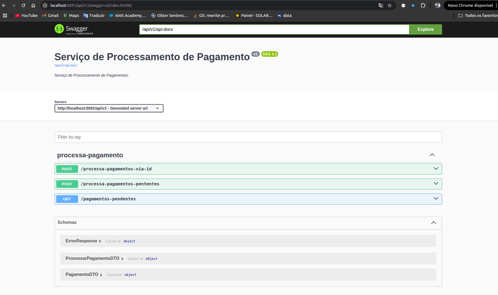
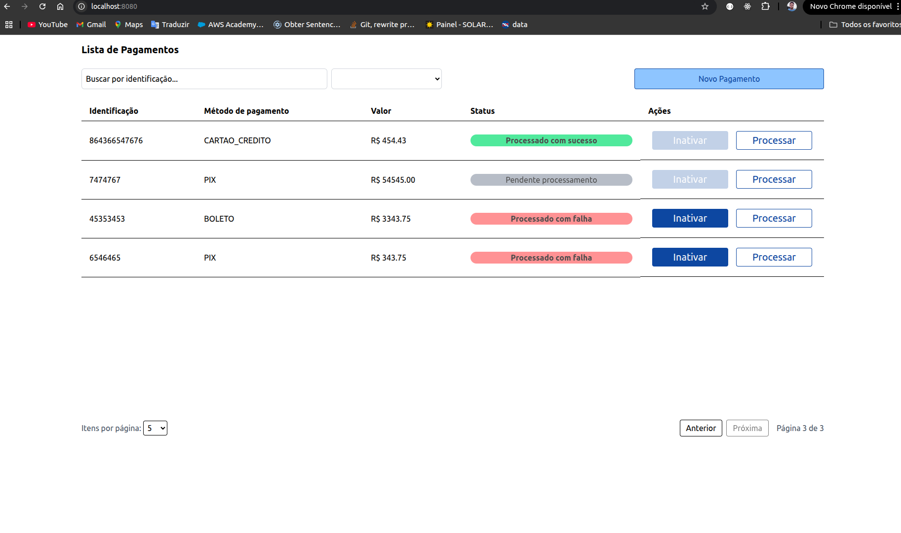
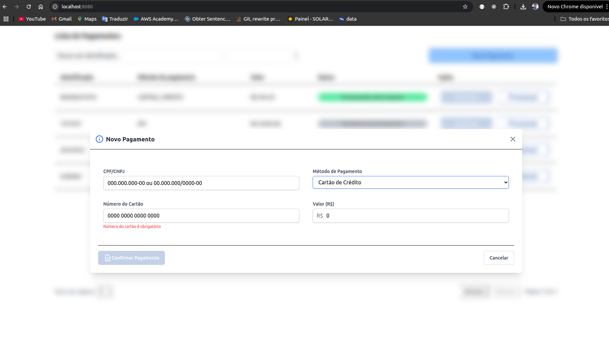
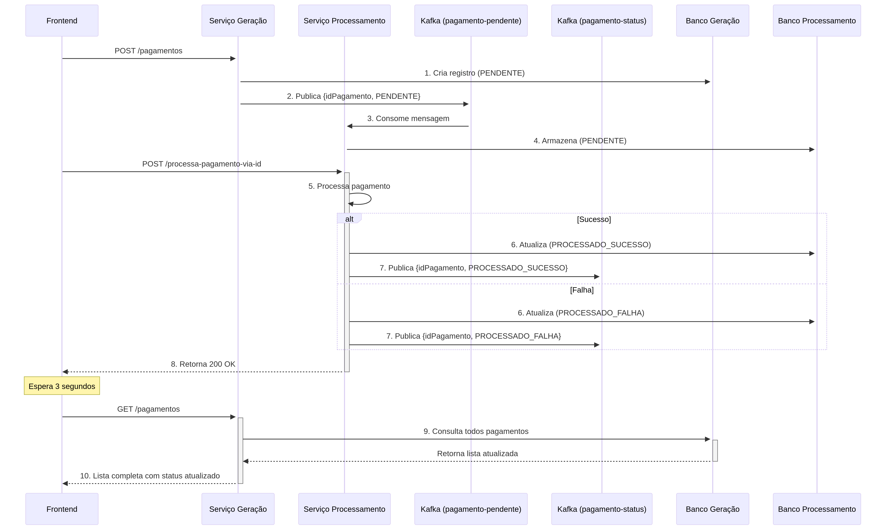

# Serviço de Gerenciamento de Pagamentos(Desafio Sefa)
## Tecnologias usadas
### API de Gração de Pagamentos
- Java jdk 17 e SpringBoot 3
- Mongo 8
- Kafka 4
- maven
### API de Processamento de Pagamentos
- Kotlin jdk 17 e SpringBoot 3(gradle)
- Mongo 8
- kafka 4
- gradle
### Frontend
- Angular 20
- TypeScript
- Tailwind 4
- Gerador de client a partir da doc do swagger(lib swagger-typescript-api)
### Geral
- Dockerfile
- Docker Compose
- Toda aplicação está em um docker compose na raiz do projeto
## Prints
### API de geração de pagamentos

---
### API de processamento de pagamentos

### Frontend de pagamentos


## Fluxo da Aplicação


### Iniciando a Aplicação com docker compose
- Clone o projeto na sua maquina
```bash
git clone https://github.com/Alfser/projeto-pagamentos.git
```
- As variáveis padrão de .env.exemplo já possuem as configurações padrão para rodar toda aplicação no docker compose
- Na raiz dos projetos das APIs inicialize as variáveis de ambiente, como segue(no linux)
```bash
cp .env.exemplo .env &&
cp gera-pagamentos/.env.exemplo gera-pagamentos/.env &&
cp processa-pagamentos/.env.exemplo processa-pagamentos/.env
```
- Depois execute os comando docker para construir a imagem e subir os containers(linux/windows)
```bash
docker compose build --no-cache &&
docker compose up -d
```
ou
```bash
docker-compose build --no-cache &&
docker-compose up -d
```
## 4. Serviços

| Serviços               | url                          | Descrição                          |
|-----------------------|-----------------------------------|--------------------------------------|
| **Pagamentos Frontend**    | [http://localhost:8080](http:/localhost:8080) | Frontend Angular |
| **Generação de Pagamentos API**    | [http://localhost:8090/api/v1/](http://localhost:8090/api/v1/) | Documentação Swagger OpenAPI 3              |
| **Processamento de Pagamentos API**    | [http://localhost:8091/api/v1/](http://localhost:8091/api/v1/) | Documentação Swagger OpenAPI 3 |
| **MongoDB**          | `mongodb://localhost:27018 mongodb://mongodb:27018`      | Banco de dados Mongo   |
| **Kafka**            | `localhost:9092 broker:9092`         | Broker Kafka                        |