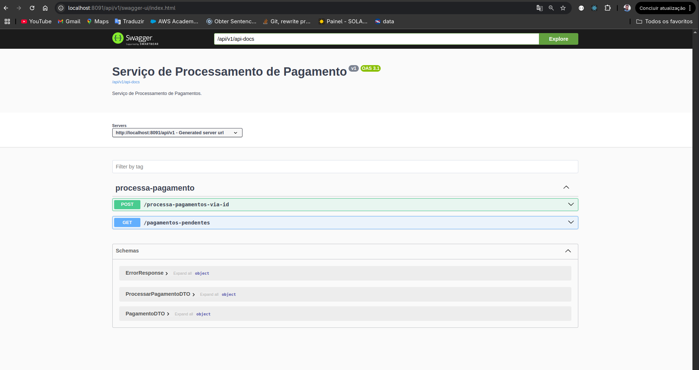

# Serviço de Gerenciamento de Pagamentos(Desafio Sefa)
## Tecnologias usadas
### API de Gração de Pagamentos
- Java jdk 17 e SpringBoot 3(maven)
- Mongo 8
- Kafka 4
### API de Processamento de Pagamentos
- Kotlin jdk 17 e SpringBoot 3(gradle)
- Mongo 8
- kafka 4
### Frontend
- Angular 20
- TypeScript
- Tailwind 4
- Gerador de client a partir da doc do swagger(lib swagger-typescript-api)
## Prints
### API de geração de pagamentos

---
### API de criação de pagamentos

### Frontend de pagamentos

## Fluxo da Aplicação
